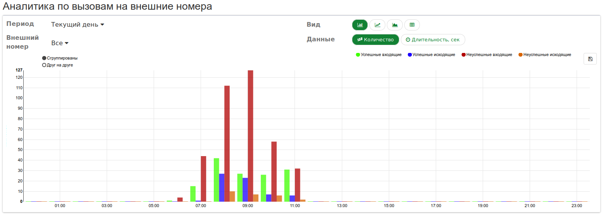

## Раздел "Аналитика"
В разделе Аналитика отображается информация по вызовам, совершенным в ВАТС.
Выплывающее меню содержит, как правило, несколько разделов. Аналитические отчеты будут строится в зависимости от того, по каким номерам требуется статистика.

Как уже говорилось ранее, абоненту доступно несколько вариантов сбора аналитических данных, по количеству совершаемых телефонных звонков в течении работы ВАТС.

##### Подменю "История звонков"

Войдя в данное подменю, абонент, видит форму отчета, для формирования которого, требуется ручной ввод данных (в правой части страницы)

Давайте более подробно рассмотрим форму запроса, для формирования отчета.

Как показано на рисунке выше, в данной форме присутствуют несколько ***обязательных*** полей, которые отмечены специальным символом (символ **" _*_ "**, красного цвета).

Так, например, если выбрать указателем мыши любое из этих полей, то откроется интерактивное меню выбора **даты** начала/конца интересующего, Вас, периода совершения звонков.

Также, Данная форма позволяет задать более детальные условия для поиска требуемой аналитической информации:
    - Начало вызывающего номера
    - Начало вызываемого номера
    - Статус звонка (по умолчанию выбрана категория ***все звонки***, но, можно отображать только ***успешные*** или только ***неуспешные*** (т.е пропущенные, абонент не дождался ответа и т.д.) звонки).

После заполнения необходимой информации для формирования требуемого аналитического запроса, следует нажать на кномпу **Отправить**, расположенную внизу формы. 

##### Подменю "Внутренние номера"

**Внутренние номера** – раздел, в котором предоставляются статистические данные в виде сводной таблицы по ***входящим/исходящим*** вызовам на внутренних номерах ВАТС. Нажмите на раздел **Внутренние номера** и перейдите во вкладку с настройками.

Вкладка содержит следующие данные и параметры для настройки:

**Период** – параметр, в котором выбирается временной период для построения отчета.

Доступные варианты:
- **Текущий день** – показывает статистику текущего дня;
- **Текущая неделя** – показывает статистику текущей недели;
- **Текущий месяц** – показывает статистику текущего месяца;
- **Текущий год** – показывает статистику за текущий год;
- **Ручной ввод** – дает возможность настроить даты выборки в индивидуальном порядке.

> Для настройки параметра нажмите на кнопку выплывающего меню рядом с записью указанного периода.

**Считать успешными длительность больше, сек** – параметр, позволяющий определить какие вызовы считать успешными в зависимости от их продолжительности в секундах. Для настройки параметра нажмите на кнопку выплывающего меню рядом с записью указанного периода.

Возможные варианты для выбора:­
- **0** – успешными считаются все вызовы длительностью больше 0 секунд;
- **30** – успешными считаются все вызовы длительностью больше 30 секунд;
- **60** – успешными считаются все вызовы длительностью больше 60 секунд.                

Выставив необходимые параметры, вы получите таблицу с данными по всем внутренним вызовам.

Таблица разделена на две части по типу вызовов:­
**_Входящие_** – раздел колонок, предоставляющий детализированную аналитику по всем входящим вызовам на внутренние номера за указанный период времени;
**_Исходящие_** – раздел колонок, предоставляющий детализированную аналитику по всем исходящим вызовам на внутренние номера за указанный период времени.
Так же, таблица имеет следующие колонки:
    > **Сотрудник** – колонка с внутренним номером сотрудника, участвующего в вызове. Так же, в данной колонке присутствует возможность быстрой фильтрации по отдельным внутренним номерам.
    > **Успешных** – колонка с количеством успешных (длительность больше той, что указана в параметре **Считать успешными длительность больше, сек**) входящих или исходящих вызовов, в которых участвовал сотрудник с указанным внутренним номером в рамках выбранного промежутка времени.
    > **Неуспешных** - колонка с количеством неуспешных (длительность меньше той, что указана в параметре **Считать успешными длительность больше, сек** или неотвеченный) входящих или исходящих вызовов, в которых участвовал сотрудник с указанным внутренним номером в рамках выбранного промежутка времени.
    > **Общая длительность, сек** – колонка с суммарной продолжительностью успешных вызовов с внутренним номером сотрудника.
    > **Средняя длительность, сек** – колонка со средней продолжительностью успешных вызовов с внутренним номером сотрудника.

##### Подменю "Внешние номера"

Как видно из рисунка, представленного выше, внешний вид данной вкладки слегка отличается от внешнего вида вкладки **"Внутренние номера"**. Как вы уже успели заметить, внешний вид вкладки слегка изменился, как вместе с тем, слегка поменялся и вид предоставляемой информации. Так же, добавились новые опции для настройки:

- **Внешний номер** – параметр, позволяющий настроить аналитику для определенного внешнего (городского) номера ВАТС. Доступные варианты:
  - **Все** – значение, которое позволяет получить выборку по вызовам на все внешние (городские) номера ВАТС.
  - **Конкретный номер** – значение, которое позволяет получить выборку по вызовам на
конкретный внешний (городской) номер ВАТС.

> Для настройки параметра нажмите на кнопку выплывающего меню рядом с записью указанного внешнего номера. Выберите желаемый **внешний** номер и аналитическая таблица будет переформирована, с учетом введенных вами данных.

- **Вид** – параметр, который дает возможность выбора типа графика (линейный, гистограмма, комплексный заполненный линейный) и отображение статистики в виде сводной таблицы. 

- **Данные** – параметр, который задает формат предоставления аналитических данных.
 Допустимые значения параметра:
  - **Количество** – при выборе данного значения, данные на графиках (вертикальная ось) и сводной таблице будут учитываться по количеству вызовов.
  - **Длительность** - при выборе данного значения, данные на графиках (вертикальная ось) и сводной таблице будут учитываться по общей продолжительности вызовов.

##### Подменю "Детализация"
**"Детализация"** – раздел, в котором предоставляются более полные статистические данные в виде сводной таблицы.

При переходе в данный подпункт меню **"Аналитика"**, будет сформирована сводная таблица, включающая в себя данные по звонкам, произошедшим в указанный промежуток времени.

Как показано на рисунке выше, данная таблица условно разделена на несколько столбцов:

  - **Дата** - данное поле содержит в себе дату совершенного звонка (имеет формат, вида **гггг-мм-дд чч-мм-сс**)
  - **Вызывающий** - в данном поле указывается телефонный номер вызывающего абонента (указывается нолный номер вызывающего абонента, однако, следует помнить, что междугородние и международные номера указываются без первой цифры **" 8 "**. Так же, если звонок совершен с внутреннего номера (номера сотрудника), то будет указан этот номер, напр. 302 или 407 (в соотв. с нумерацией, принятой в, Вашей, организации)).
  - **Вызываемый** -  в данном поле указывается телефонный номер вызываемого абонента (зачастую указывается внешний (городской) номер, на который поступил вызов (в случае, если имеется ввиду **вх. звонок**)).
  - **Длительность** - в данном поле указывается продолжительность звонка (имеет вид: **чч-мм-сс**).

Так же, данный вид сбора аналитических данных, имеет возможность дополнительной фильтрации представляемых данных: так, например, воспользовавшись функциональными кнопками вверху таблицы можно запросить:
- выбор периода совершения звонка (по аналогии с предыдущими пунктами)
- внешний номер (здесь имеется ввиду, на какой номер поступил звонок)
- какой вид звонков следует вывести на экран (все, только успешные, только неуспешные)
- выбор направления звонка (все, только входящие, только исходящие).

---