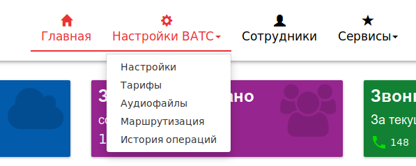

## Элементы меню "Настройки ВАТС"
В данном разделе производятся общие настройки сервисов для ВАТС в целом, а так же, отделов и сотрудников.

Данный раздел содержит следующие пункты:
 + Меню **"Настройки"** - представляет собой меню, в котором производятся настройки услуг всей ВАТС;
 + Меню **"Тарифы"** - меню предоставляется возможность выбрать один из предлагаемых оператором связи тарифных пакетов с фиксированным набором услуг. Изначально тариф определяется оператором связи по факту заключения договора. Действующий тариф, как правило, выделяется "желтой рамкой";
 + Меню **"Аудиофайлы"** - в данном разделе меню производится загрузка (и хранение) аудиофайлов, которые могут быть, в последствии, использованы в работе других сервисов ВАТС;
 + Меню **"Маршрутизация"** - меню, отвечающее, в большей степени, за обработку входящих звонков. Например за перенаправление входящего звонка на **"Голосовое меню"** или **"Группу обзвона"**;
 + Меню **"История операций"** - раздел меню, в котором содержится полная история всех операций, производимых на веб-интерфейсе ВАТС. Максимальный срок хранения данных, примерно – 180 дней.
