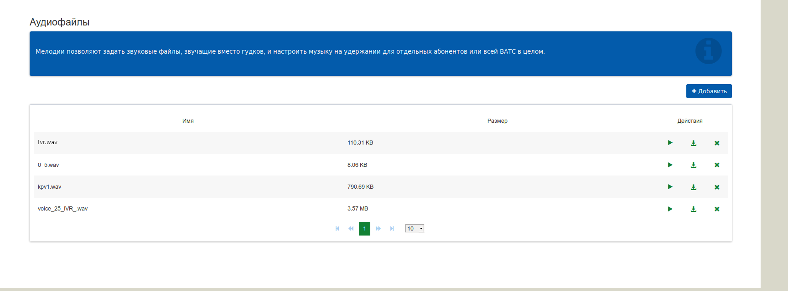
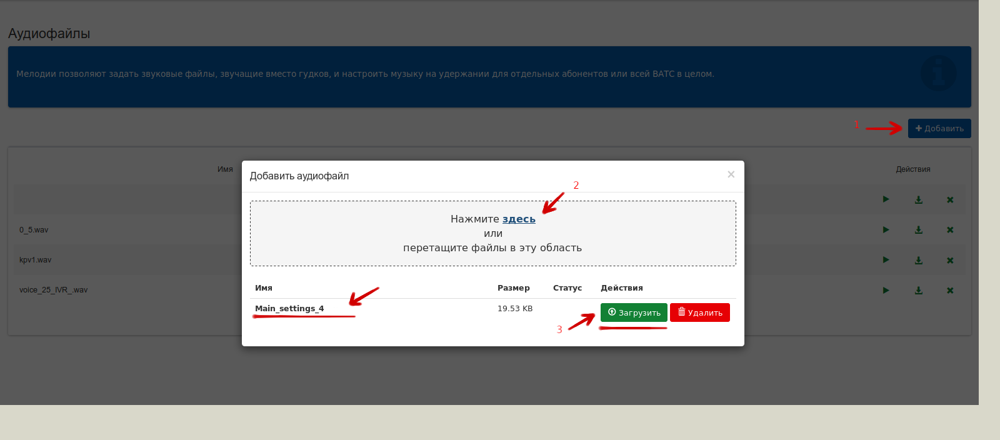

## Аудиофайлы

В разделе меню Аудиофайлы производится загрузка (и хранение) аудиофайлов, которые могут быть использованы:
1. В настройках ВАТС для персонализации мелодии вызова («Гудок») и мелодии на удержании.
0. В настройках звуковых и голосовых оповещений сервиса Голосовое меню.
0. В настройках мелодий сервиса Группы обзвона.

 > Настройка доступна только администраторам ВАТС / отделов.

Для добавления необходимого аудиофайла произведите следующие действия:
- Нажмите кнопку Добавить
- В появившемся окне нажмите кнопку «здесь» и выберите из списка нужный файл с расширением .wav.
- После выбора нужного файла, нажмите "Загрузить"

- Проконтролируйте загрузку нужного файла. Если все действия выполнены правильно, то выбранный ранее файл отобразится в графе **"Имя"**.

С аудиофайлами можно выполнить следующие действия:
- прослушать;
- скачать;
- удалить.