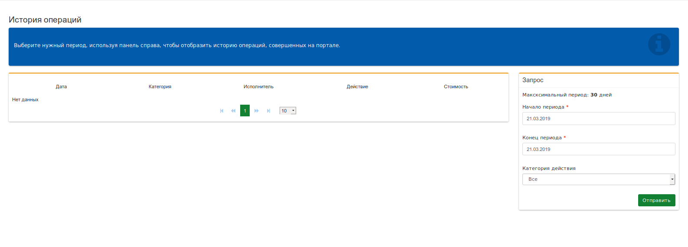

## История операций

Раздел меню, в котором содержится полная история всех операций, производимых на веб-интерфейсе ВАТС. Максимальный срок хранения данных – 180 дней.

 > Настройка доступна только администраторам ВАТС.

Если вам необходимо посмотреть действия, производимые в веб-интерфейсе ВАТС, за какой-то определенный период и в конкретном разделе, необходимо заполнить поля панели **Запрос**, задав параметры выборки данных:
 - *Начало периода* – начальная дата для выборки данных;
 - *Конец периода* – конечная дата для выборки данных;
 - *Категория действий* - возможная категория для выборки данных. Доступные категории:
    - Все действия;
    - Настройки;
    - Расширения;
    - Персонал;
    - Сервисы;
    - Статистика;
    - Невыполнимые запросы.

 > Работа данного раздела, во многом, похожа на работу раздела **"Аналитика"**
***