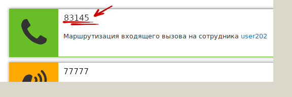

## Маршрутизация

Используйте раздел меню Маршрутизация для настройки обработки входящих вызовов на внешние (городские) номера ВАТС с использованием таких сервисов как:
- Голосовое меню;
- Переадресация вызовов на внутренние номера и сервисы;
- Группы обзвона.

 > Настройка доступна только администраторам ВАТС.

Для базовой настройки маршрутизации, следует выполнить следующие действия:
1) Нажимаем кнопку Настроить и входим в меню настройки (имеентся ввиду, что следует нажать на сам внешний номер, в нашем случае 83145)

2) В открывшемся меню, выполняем следующие настройки:

- **Тип маршрутизации** – параметр, определяющий маршрут вызова по факту его принятия. Он может быть отправлен на сервис или сотрудника ВАТС. Доступные значения параметра:
    - Сотрудник – вызов конкретного сотрудника;
    - Группа обзвона – вызов конкретного сервиса Группа обзвона;
    - Факс – вызов конкретного сервиса Виртуальный факс;
    - Конференция – вызов конкретного сервиса Конференция;
    - Голосовое меню – вызов сервиса Голосовое меню.

> В примере выбран сервис **Сотрудник**

- **Значение** – параметр, в котором представлен список конкретных сотрудников или сервисов, в зависимости от выбранного Типа маршрутизации.

- **Время работы** – параметр, который определяет временной период работы данного шага. Доступные значения параметра:
    - *Круглосуточно* – в случае выбора данного значения входящие вызовы будут попадать на выбранный сервис 24 часа в сутки.
    - *По расписанию* – в случае выбора данного значения предоставляется возможность настройки расписания (конкретные дни и часы) на всю неделю или специальный день.

3) Нажимаем кнопку **Сохранить**. В списке напротив номера должен появиться тип настроенной маршрутизации.

