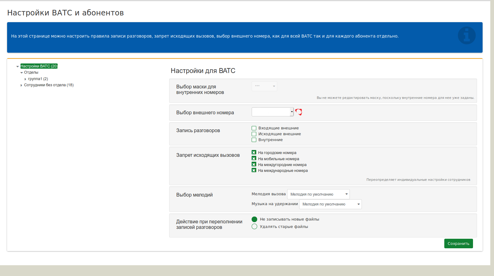
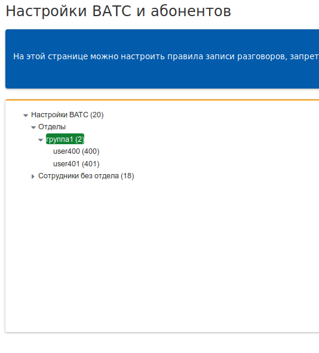
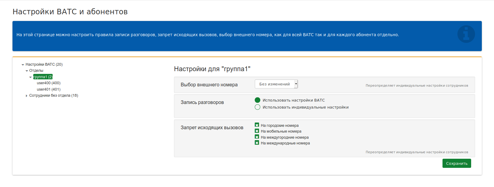
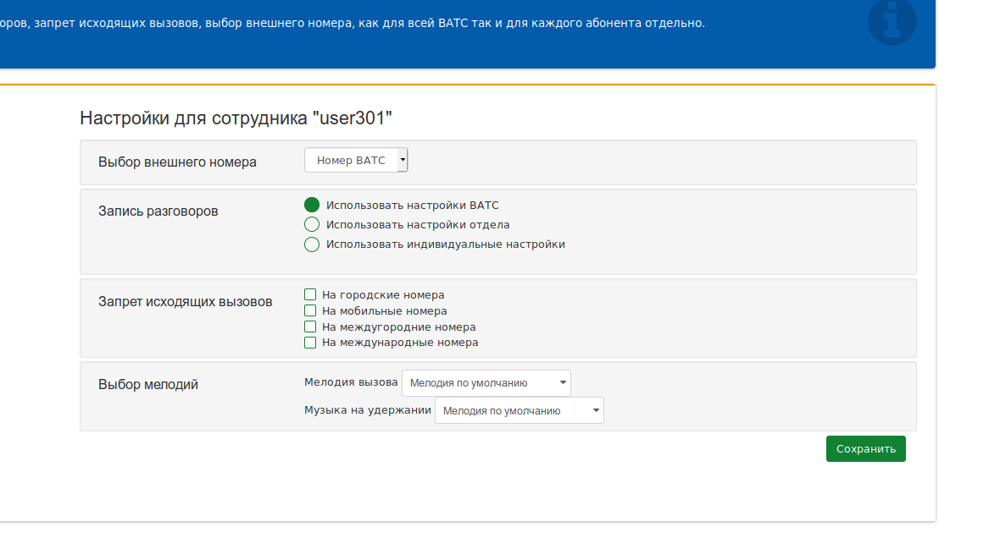

## Настройки
Как уже говорилось ранее, раздел **"Настройки"** - раздел отвечающий за общие настройки сервисов для ВАТС в целом, отделов и сотрудников.
 > Исходя из этого определения, следует заменить, что, настройки данного раздела, могут выполняться только при наличии привелегий **"администратора ВАТС/отдела"** (см. раздел "Сотрудники" -> "Добавление учетной записи сотрудника" -> "Роль")

 > В случае изменения настроек доступных опций в блоке с записью ***Переопределяет индивидуальные настройки сотрудников***, они будут применены ко **всем** созданным отделам и сотрудникам.

 + **Выбор маски для внутренних номеров** – параметр, который определяет количество цифр внутреннего номера ВАТС;
 + **Выбор внешнего номера** – параметр, определяющий с какого внешнего (городского) номера будут производиться вызовы всех сотрудников ВАТС при вызове в город. Если в ВАТС были созданы учетные записи отделов и сотрудников, можно произвести индивидуальную (перекрывающую общую) настройку для каждого;
 + **Запись разговоров** – блок настроек услуги записи разговоров:
   + **Входящие внешние** – при выставлении галки напротив данной опции, будут записываться все входящие внешние вызовы (из города). Разговор записывается только после установления соединения. Записанный разговор будет доступен на странице **"Записи разговоров"**;
   + **Исходящие внешние** – при выставлении галки напротив данной опции, будут записываться все исходящие внешние вызовы (в город). Разговор записывается только после установления соединения. Записанный разговор будет доступен на странице **"Записи разговоров"**;
   + **Внутренние** - при выставлении галки напротив данной опции, будут записываться все внутренние (между сотрудниками) вызовы (входящие / исходящие). Разговор записывается только после установления соединения. Записанный разговор будет доступен на странице **"Записи разговоров"**.
 + **Запрет исходящих вызовов** – блок настроек запрета исходящих вызовов (по направлению) на внешние номера. Настраивается после заведения в ВАТС учетных записей сотрудников.
 + **Выбор мелодии** – настройки выбора мелодий для вызова из списка загруженных аудиофайлов.
   + **Мелодия вызова** («Гудок») – звуковой файл, который проигрывается звонящему сотруднику во время ожидания ответа. Его можно выбрать из списка уже загруженных аудиофайлов или использовать вариант по умолчанию (стандартный файл, поставляемый в комплекте ВАТС);
   + **Мелодия на удержании** – звуковой файл проигрываемый сотруднику, вызов с которым был поставлен на удержание. Его можно выбрать из списка уже загруженных аудиофайлов или использовать вариант по умолчанию (стандартный файл, поставляемый в комплекте ВАТС).
 + **Действие при переполнении записей разговоров** – настройка услуги Запись разговора, которая определяет действие в случае превышения допустимого (согласно выбранному Тарифу) объема записи голосовых файлов:
   + **Не записывать новые файлы** – в случае выбора опции новые голосовые файлы записываться не будут. Для выбора установите флаг напротив записи.
   + **Удалять старые файлы** – в случае выбора данной опции, при записи нового голосового файла удаляется старый файл(ы), размер которого необходим для записи нового.

2) **Настройки для отдела**

В правой части меню **"Настройки"** можно произвести настройки созданных отделов и отдельных сотрудников. Для этого следует перейти в соотв. меню:

 + Страница настроек услуг доступных для конкретного отдела:

+ **Выбор внешнего номера** – параметр, определяющий с какого внешнего (городского) номера будут производиться вызовы всех сотрудников отдела при вызове в город. Возможные опции для выбора:
   + *Без изменений* – разрешается выбрать внешний (городской) номер для каждого сотрудника отдела индивидуально;
   + *Номер ВАТС* – за отделом закрепляется внешний (городской) номер ВАТС, заданный в глобальных настройках (см. Настройка ВАТС > Выбор внешнего номера).
+ **Запись разговоров** – блок настроек опций для записи разговоров:
   + **Использовать настройки ВАТС** – в случае выбора опции будут применены глобальные настройки ВАТС;
   + **Использовать индивидуальные настройки** – возможность выбрать опции записи разговоров для конкретного отдела:­
     + **Входящие внешние** – при выставлении галки напротив данной опции, будут записываться все входящие на данный отдел внешние вызовы (из города). Разговор записывается только после установления соединения. Записанный разговор будет доступен на странице **"Записи разговоров"**;
     + **Исходящие внешние** – при выставлении галки напротив данной опции, будут записываться все исходящие от данного отдела внешние вызовы (в город). Разговор записывается только после установления соединения. Записанный разговор будет доступен на странице **"Записи разговоров"**;
     + **Внутренние** - при выставлении галки напротив данной опции, будут записываться все внутренние вызовы (входящие / исходящие). Разговор записывается только после установления соединения. Записанный разговор будет доступен на странице **"Записи разговоров"**.
+ **Запрет исходящих вызовов** – блок настроек запрета исходящих вызовов (по направлению) на внешние номера.

3) **Настройка для сотрудника**
Страница настроек услуг доступных для конкретного сотрудника.

+ **Выбор внешнего номера** – параметр, определяющий с какого внешнего (городского) номера будут производиться вызовы сотрудника ВАТС при вызове в город. Возможные опции для выбора:
  + Номер ВАТС – за сотрудником закрепляется внешний (городской) номер ВАТС, заданный в глобальных настройках;
  + Сотруднику присваивается индивидуальный внешний (городской) номер (из списка доступных внешних (городских) номеров).
+ **Запись разговоров** – блок настроек опций для записи разговоров.
  + Использовать настройки ВАТС – в случае выбора опции будут применены глобальные настройки ВАТС;
  + Использовать настройки отдела (при условии, что сотрудник входит в отдел)
  + Использовать индивидуальные настройки – возможность выбрать опции записи разговоров для конкретного сотрудника индивидуально:
    + *Входящие внешние* – при выставлении галки напротив данной опции, будут записываться все входящие на данного сотрудника внешние вызовы (из города). Разговор записывается только после установления соединения. Записанный разговор будет доступен на странице **Записи разговоров**;
    + *Исходящие внешние* – при выставлении галки напротив данной опции, будут записываться все исходящие от данного сотрудника внешние вызовы (в город). Разговор записывается только после установления соединения. Записанный разговор будет доступен на странице **Записи разговоров**;
    + *Внутренние* - при выставлении галки напротив данной опции, будут записываться все внутренние (с участием сотрудника) вызовы (входящие / исходящие). Разговор записывается только после установления соединения. Записанный разговор будет доступен на странице **Записи разговоров**.
+ **Запрет исходящих вызовов** – блок настроек запрета исходящих от данного абонента вызовов (по направлению) на внешние номера.
+ **Выбор мелодии** – настройки выбора мелодий для вызова из списка загруженных аудиофайлов.
  + *Мелодия вызова* («Гудок») – звуковой файл, который проигрывается звонящему сотруднику во время ожидания ответа. Его можно выбрать из списка уже загруженных аудиофайлов (см. раздел **Аудиофайлы**) или использовать вариант по умолчанию (стандартный файл «Гудок», поставляемый в комплекте ВАТС);
  + *Мелодия на удержании* – звуковой файл проигрываемый сотруднику, вызов с которым был поставлен на удержание. Его можно выбрать из списка уже загруженных аудиофайлов (см. раздел **Аудиофайлы**) или использовать вариант по умолчанию (стандартный файл, поставляемый в комплекте ВАТС).

 > После внесения изменений, не забывайте их сохранять!