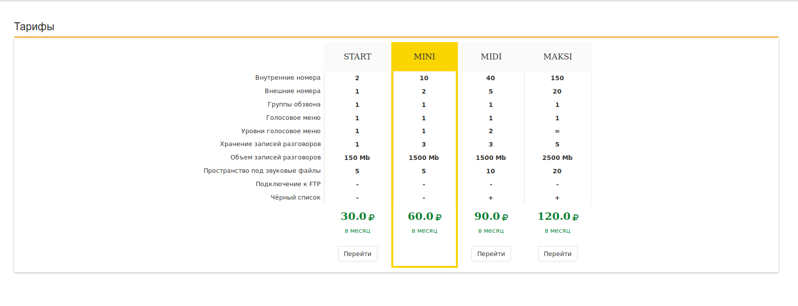

## Тарифы

В данном разделе меню предоставляется возможность выбрать, один из предлагаемых оператором связи, тарифный пакет с фиксированным набором услуг. Изначально тариф определяется оператором связи по факту заключения договора.

 > Действующий тариф выделен в «желтой рамке».

В случае если вы хотите поменять тарифный план, выполните следующие действия:
- Нажмите кнопку Перейти, расположенную внизу выбранного тарифного пакета.
- В появившемся окне выставьте галку напротив записи «Я подтверждаю» (таким образом, вы даете согласие на условия, связанные с выбором тарифа).
- Нажимаете кнопку Продолжить.
  - Запрос уходит на обработку оператору связи.
  - По факту успешной обработки запроса новый тарифный план будет выделен «желтой рамкой».
     