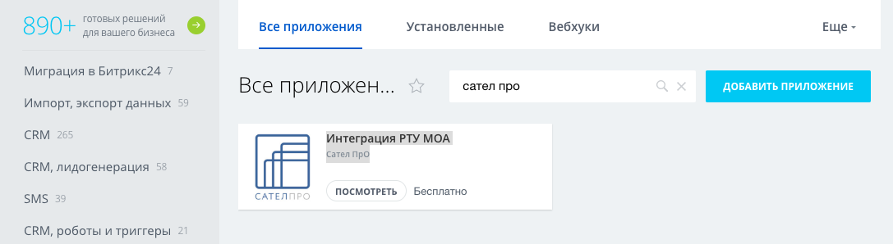
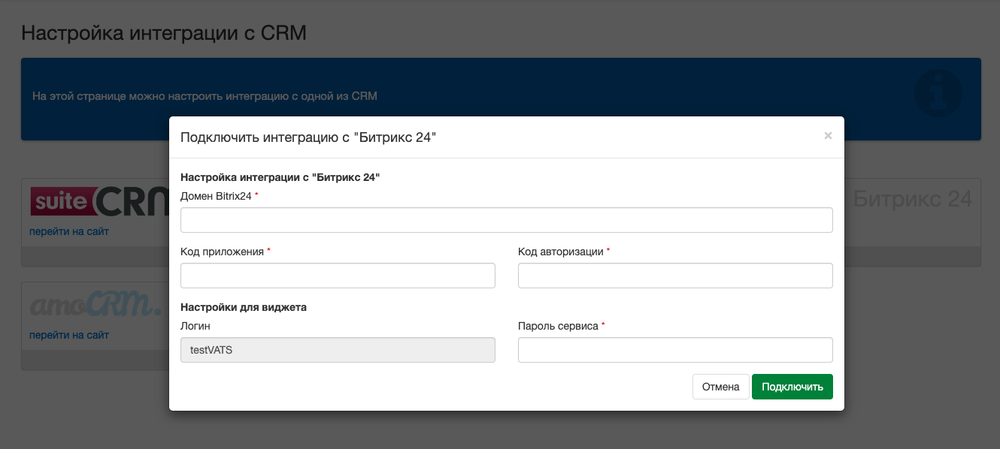
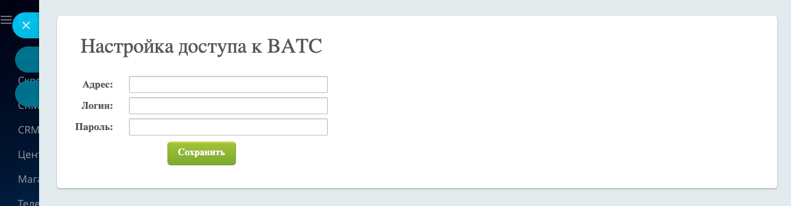
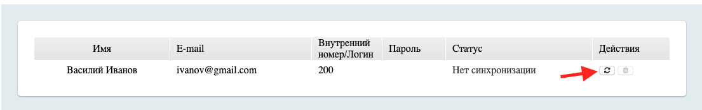
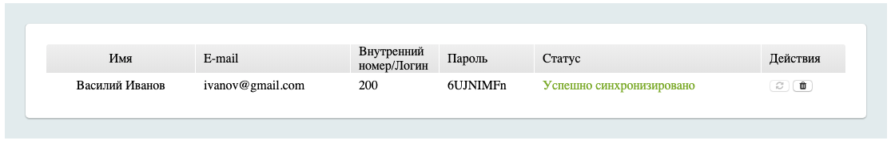
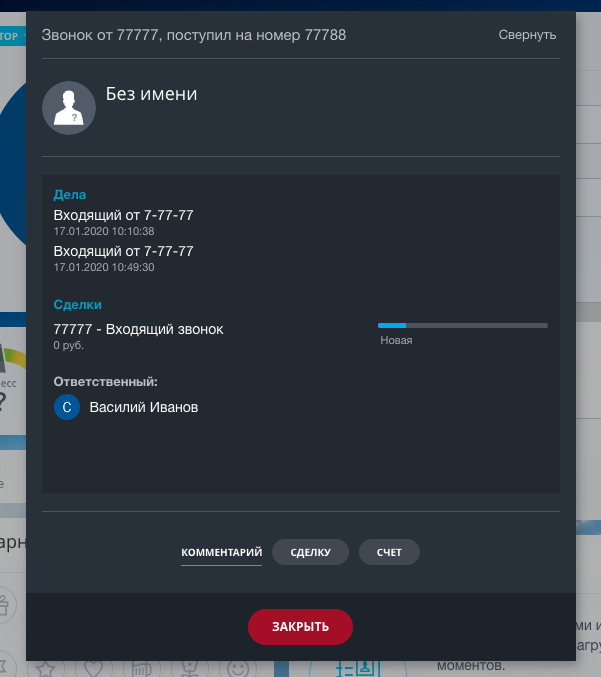

## Интеграция с Битрикс24

Для настройки интеграции в веб кабинете bitrix24 необходимо установить приложение "Сател Про"

Для настройки интеграции в веб кабинете портала ВАТС необходимо перейти в Сервисы > Интеграция с CRM и выбрать "подключить Битрикс 24".

В поле "Домен bitrix24" вводим адрес вашего домена bitrix24, который можно посмотреть в адресной строке вашего браузера например:

в данном случае он
 https://b24-jp89pb.bitrix24.ru/

"Код приложения" и "Код авторизации" выдаются по запросу по факту подключения услуги.

В поле "Пароль" сервиса необходимо придумать надежный пароль.

В дальнейшем логин и придуманый пароль нужно будет ввести в настройках виджета "Сател Про", а в поле "Адрес" указываем https://rtu1.sv-tel.ru:8431/

далее в меню Битрикс 24 заходим в "РТУ МОА" и нажимаем кнопку "Синхронизация",

и дожидаемся статуса "Успешно синхронизировано".

При звонках на внутренний номер сотрудника, а так же исходящих звонках с внутреннего номера сотрудника, будет открываться всплывающее окно с информацией.

