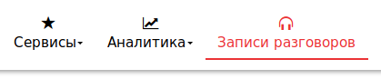
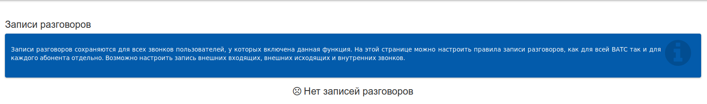
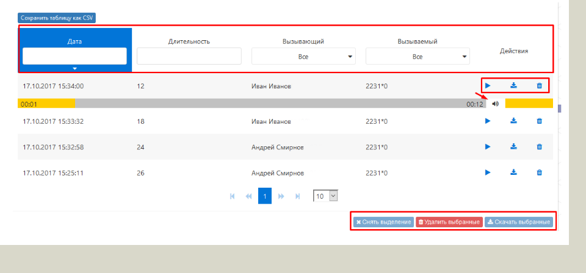

## Раздел "Записи разговоров"

**Записи разговоров** - раздел меню, который содержит списки с записями разговоров всех сотрудников, регистрированных в ВАТС (у которых включена данная функция (см. соотв. раздел).

*При этом администратор ВАТС видит записи разговоров всех сотрудников, администратор отдела – записи сотрудников, закрепленных за его отделом, а сотрудник с присвоенной ролью «Пользователь» видит только свои записи.*

*Доступные опции для сортировки данных с записанными разговорами:*
- Дата – поле для выбора временного периода обработки данных;
- Длительность – поле, в котором задается необходимая длительность разговора в секундах;
- Вызывающий – выплывающее меню, позволяющее выставить фильтр по конкретным сотрудникам
(выбранные из списка), которые совершали исходящие вызовы;
- Вызываемый – выплывающее меню, позволяющее выставить фильтр по конкретным телефонным
номерам, на которые осуществлялись вызовы.

Так же доступны некоторые действия, такие как, например: прослушивание записанных разговоров, сохранение и удаление записей, а так же, сохранение списка с информацией о записанных разговорах в формате CSV-файла.