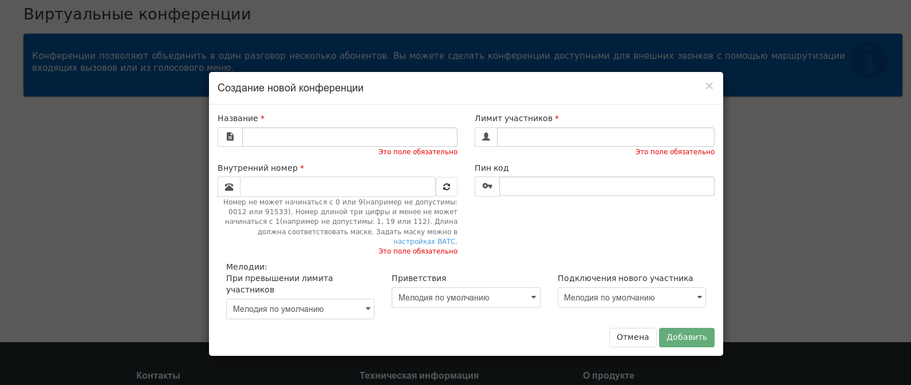

## Конференции

Сервис **Конференции** позволяет объединить в один разговор трех и более собеседников.

Перейдя в раздел ***"Конференции"*** меню **"Сервисы"** на панели навигации ВАТС, перед вами откроется страница создания конференций (см. рис. выше). Для создания конференции необходимо нажать на кнопку **"Добавить"**, расположенную внизу страницы. После этого, откроется меню создания конференции, которое имеет следующий вид:

***Схема создания Виртуальной конференции:***
  1. **Название** – задается название создаваемой конференции.
  0. **Внутренний номер** – присваивается внутренний номер при совершении вызова на который будет создаваться конференция.
  0. **Лимит участников** – максимальное количество участников конференции.
  0. **Пин код** – цифровое значение, который необходимо ввести для присоединения к конференции. Вы не сможете присоединиться к конференции, не зная Пин-кода.
  0. **"Меню мелодий"** - позвоняет проигрывать различные мелодии, при возникновении соответствия одному из критериев:  *превышен лимит участников* (участников больше чем заявлено в настройках конференции), *подключение нового участника*, *приветствие* (позволяет проигрывать музыкальное приветствие).
  0. После ввода всех необходимых настроек, для создания конференции необходимо нажать **"Добавить"** внизу страницы.
