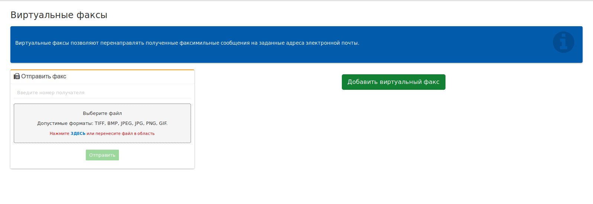

## Виртуальные факсы

Сервис Виртуальные факсы позволяют перенаправить полученные факсимильные сообщения на заданные адреса электронной почты.

Схема создания Виртуального факса:
1) Нажмите клавишу **"Добавить виртуальный факс"** в главном окне

2) В открывшемся окне, заполните обязательные поля (отмечены специальным символом) и нажмите кнопку **"Сохранить"** внизу формы

3) В случае правильного выполнения всех действий, запись о созданном факсе будет фигурировать в общем списке и факс (в данном случае "виртуальный факс") можно будет использовать для выполнения различных задач, например для интергации его в "Голосовое меню ВАТС"