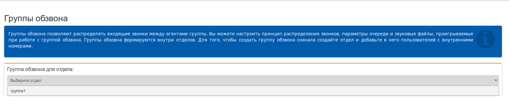
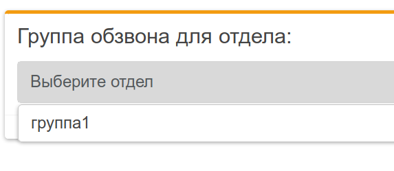
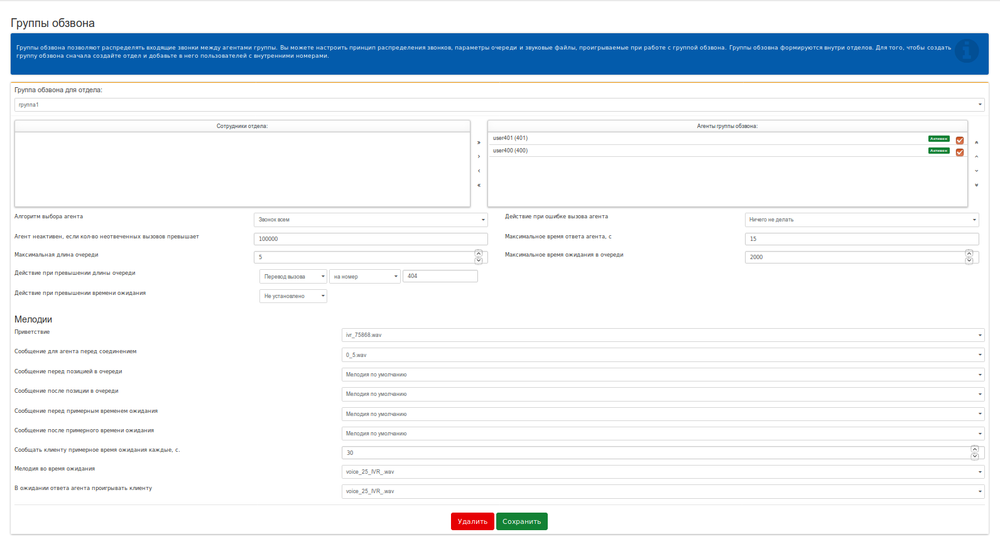
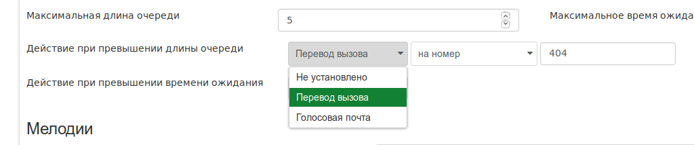
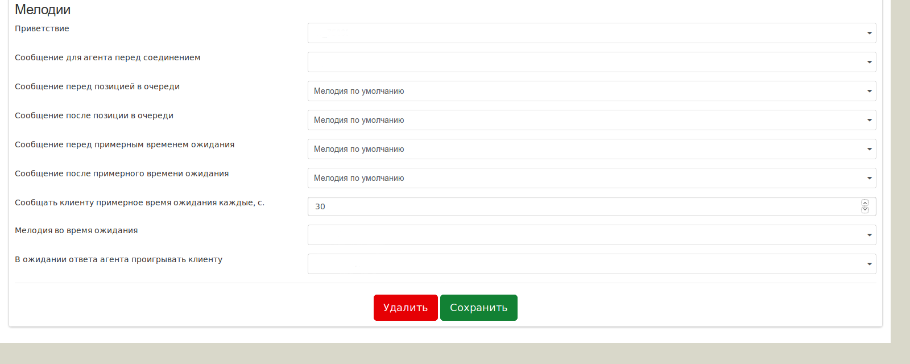

## Группы обзвона

Сервис **"Группы обзвона"** решает задачу распределения потока входящих вызовов на сотрудников ВАТС, объединенных в отдел.

Перейдя в данный пункт меню, откроется диалог выбора "Группы обзвона" (см. рис.)

Для того, чтобы перейти к настройке группы, следует выбрать элемент с соответствующим названием из всплывающего списка (на рисунке выше, показано, что в нашем случае, создана всего 1 группа).
Далее будет рассмотрен пример типовой настройки "Группы обзвона", на примере уже созданного отдела (в нашем случае группа1):
  1. Выбираем отдел (из списка зарегистрированных), который будет принимать входящие вызовы (например, группа1).

  После выбора элемента для настройки (в нашем случае - группа1), откроется окно основных настроек "Группы обзвона"

  

  2. Выбираем из списка сотрудников, которые будут в группе и переносим в панель **Агенты группы обзвона**.
  > ***Агент группы обзвона*** – сотрудник с внутренним номером, который участвует в группе обзвона.
  3. Выполняем настройки для Группы обзвона, связанные с обработкой входящего вызова:
  - ***Алгоритм выбора агента*** – параметр, который определяет механизм распределения вызовов на агентов. Выберите из выпадающего меню подходящий для вас вариант обработки входящего
вызова:
    1. **По времени простоя** – в случае выбора данного значения, входящий вызов будет
направляться на сотрудника с самым долгим периодом простоя.
    0. **По наименьшему количеству ответов** - в случае выбора данного значения, входящий
вызов направляется на агента с наименьшим количеством отвеченных вызовов.
    0. **По наименьшей общей длительности вызова** - в случае выбора данного значения,
входящий вызов направляется на свободного агента с наименьшей общей (по всем
обработанным) длительности вызовов.
    0. **Случайный выбор агента** – в случае выбора данного значения, входящий вызов
направляется на свободного агента, выбранного сервисом случайным образом.
    0. **По позиции в списке** – в случае выбора данного значения, входящий вызов направляется на первого свободного агента, согласно приоритету (сверху вниз) в списке.
    0. **Звонок всем** – в случае выбора данного значения, входящий вызов направляется на всех агентов (сотрудников) группы обзвона одновременно. Таким образом, то первый поднимет трубку, тот и обработает входящий вызов.
- ***Агент неактивен, если кол-во неотвеченных вызовов превышает*** – параметр, который отображает количество подряд не отвеченных агентом вызовов, после чего он будет выключен (убран из списка обзвона для новых вызовов). Для настройки необходимо выставить числовое значение, после которого ВАТС будет читать агента неактивным.
- ***Максимальная длина очереди*** – параметр, который указывает максимальное количество вызовов в очереди, ожидающих распределения на агентов. Пока все агенты заняты, все новые вызовы на сервис будут находиться в ожидании. В случае превышения значения, новые вызовы будут направлены на номер из **Действие при превышении длины очереди**.
- ***Действие при ошибке вызова агента*** – параметр, который определяет действии с агентом, если он по какой-то причине не смог ответить на вызов. Возможные причины: агент отбил входящий вызов; пропал сетевой доступ к телефонному аппарату агента в момент совершения на него вызова.
    - **Сделать агента неактивным на 30 сек** – агент выключается из списка обзвона (на него не распределяются вызовы) на 30 секунд.
    - **Понизить приоритет агента на 30 сек** – приоритет агента в списке распределения понижается (становится последним) на 30 секунд. На агента будут распределяться вызовы, если агенты с большим приоритетом заняты. По истечении 30 секунд агенту будет возвращен его первоначальный приоритет.
    - **Ничего не делать** - Агент остается активен, на него распределяются вызовы, даже если были случаи ошибок.
- ***Максимальное время ответа агента*** – параметр, который определяет период времени (в секундах)
в течение которого агент должен ответить на вызов, по факту неответа вызов перенаправляется на свободного агента в группе. В поле выставьте числовое значение в секундах.
- ***Максимальное время ожидания в очереди*** – параметр, который определяет период времени (в секундах) в течение которого вызов будет оставаться в очереди ожидания распределения на агента. В поле выставьте числовое значение в секундах. Если вызов так и не распределили по причине занятости всех агентов, он будет направлен на номер из параметра **Действие при превышении времени ожидания**.
- ***Действия при превышении длины очереди*** – параметр, который определяет действие, выполняемое при превышении количества (задано в параметре Максимальная длина очереди) ожидающих распределения входящих вызовов.

  Возможные варианты:­
    - *Перевод вызова* – входящий вызов направляется на номер (в примере номер 404)
    - *Голосовая почта* – входящий вызов направляется на сервис Голосовая почта для записи сообщения на **системный** ящик Голосовой почты ВАТС.
- ***Действия при превышении времени ожидания*** – параметр, который определяет действие,выполняемое при превышении времени ожидания распределения (задано в параметре **Максимальное время ожидания в очереди**) входящих вызовов.
> Разделы ***Действия при превышении длины очереди*** и ***Действия при превышении времени ожидания*** имеют идентичные варианты настройки.

  4. Выполнить настройки раздела "Мелодии"
**Мелодии** – раздел, в котором предоставляется список мелодий, которые проигрываются на  разных этапах обработки входящего вызова на сервис Группа обзвона.

Доступные настройки:
*  *Приветствие* - мелодия, которая проигрывается звонящему при звонке на номера "Группы обзвона"
* *Сообщение для агента перед соединением* – мелодия, которая проигрывается агенту и сообщат ему о соединении с клиентом (например, Соединяем с клиентом).
* *Сообщение перед позицией в очереди* – мелодия, которая проигрывается входящему вызову перед сообщением его порядкового номера в очереди ожидания.
    Допустимые значения для выбора: - мелодия по умолчанию; - мелодии со страницы Аудиофайлы.
*  *Сообщение после позиции в очереди* – мелодия, которая проигрывается входящему вызову после сообщения его порядкового номера в очереди ожидания. Допустимые значения для выбора: - мелодия по умолчанию; - мелодии со страницы Аудиофайлы.
*  *Сообщение перед примерным временем ожидания* – мелодия, которая проигрывается входящему вызову перед сообщением о времени ожидания в очереди. Допустимые значения для выбора: - мелодия по умолчанию; - мелодии со страницы Аудиофайлы.
*  *Сообщение после примерного времени ожидания* – мелодия, которая проигрывается  входящему вызову после сообщения о времени ожидания в очереди. Допустимые значения для выбора: - мелодия по умолчанию; - мелодии со страницы Аудиофайлы.
*  *Мелодия во время ожидания* – мелодия, проигрываемая на входящие вызовы, которые находятся в очереди на распределение.
*  В ожидании ответа агента проигрывать клиенту" - мелодия, проигрываемая на входящие вызовы, которые были переданы на соединение с агентом. Допустимые значения для выбора: - мелодия по умолчанию; - мелодии со страницы Аудиофайлы.
