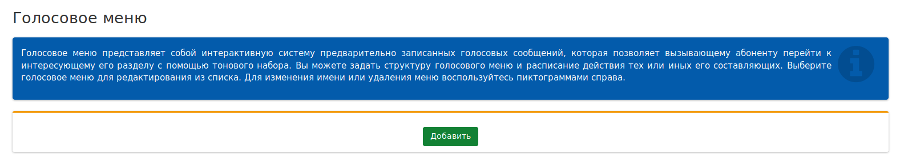
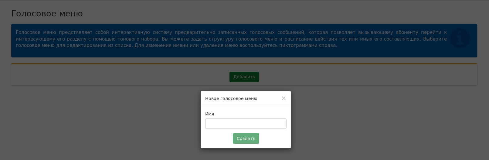
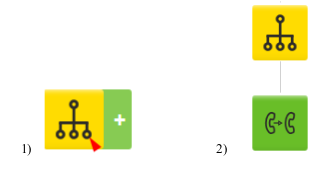
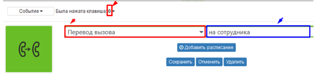

## Голосовое меню

Сервис Голосовое меню - ИВР - это записанные фразы, которые подсказывают пользователю, как попасть в нужный отдел. Когда звоните в компанию, вас приветствует автоответчик, называет отделы и номера кнопок, по которым вы переходите к нужному специалисту.

*Схема создания записи Голосового меню*:
 + В центральной панели задач нажимаем кнопку Добавить.

 + Задаем имя записи (в примере Голосовое меню) и нажимаем кнопку Создать.

  + Открываем созданную запись в режиме редактирования нажав на соответствующую кнопку после того, как она (запись) отобразилась в общем списке. И приступаем к настройке уровней голосового меню:
    - Производим настройку базового уровня. Нажимаем на иконку Голосового меню и заполняем предлагаемые поля:
      - *Количество попыток ввода* – параметр, который определяет какое количество ошибочных попыток ввода цифр (или символа *) дается звонящему на сервис для перехода по интерактивному меню. Необходимо выставить числовое значение  (количество раз), после которого последует один из настроенных сценариев (**Событие > По превышению попыток ввода**);
      - *Таймаут по не вводу* – параметр, который определяет время (в секундах) для ввода цифр (или символа *) звонящему на сервис для перехода по интерактивному меню. Для настройки необходимо выставить числовое значение в секундах, после которого последует один из сценариев настроенных в разделе (**Событие > Время ожидания ввода истекло**);
      - *При входе в меню* – мелодия, которая информирует звонящего о доступных опциях голосового меню. Для настройки выберите один из голосовых файлов из списка загруженных в разделе **Аудиофайлы**. Например, файл с записью голоса, который будет информировать вас о том, в какую организацию вы позвонили и помочь сориентироваться в меню набора.
      - *При ошибке* – мелодия, которая проигрывается в результате ошибки навигации (нажата цифра или символ *, за которым не закреплено ни одно действие интерактивного меню) по интерактивному меню. Для настройки выберите один из голосовых файлов из списка загруженных в разделе *Аудиофайлы*;
      - *При превышении лимита* – мелодия, которая проигрывается после превышения доступных попыток перехода по интерактивному меню в случае ошибок навигации. Для настройки выберите один из голосовых файлов из списка загруженных в разделе *Аудиофайлы*.
    - Создаем первый уровень голосового меню. Наведите мышку на иконку Голосового меню и
    нажмите на появившийся знак «+». При этом должен появиться новый уровень для настройки.

    

    - Нажимаем на иконку второго и заполняем поля в появившемся окне

    
    *Левое поле* – выбирается опция переадресации вызова, в случае нажатия предлагаемой
голосовым меню цифры (в примере 0).
    *Правое поле* – в зависимости от выбранной опции, указывается агент (группа) на которого будет переадресован входящий вызов. Возможные варианты:
      - Перевод вызова – на сотрудника (выбрать в списке);
      - Факс – выбрать доступный для использования **виртуальный факс**;
      - Конференция – выбрать доступную для использования виртуальную конференцию;
      - Группа обзвона - выбрать доступную для использования группу обзвона;
      - Повтор меню – при нажатии указанной цифры (в примере 0) производится повтор голосового меню;
      - Вернуться на уровень выше - при нажатии указанной цифры (в примере 0) производится переход на уровень выше (используется начиная со **второго** уровня).
    *Настройка параметров раздела **Событие***
    В Голосовом меню можно выполнить настройку параметров при совершении события (в случае совершения ошибки или при нажатии клавиши в тоновом режиме). Существует три возможных варианта:
      - **Была нажата клавиша** – стандартный вариант событийности, при котором вызов направляется на выбранный сервис после нажатия указанной цифры (можно изменить на любую другую от 0-9);
      - **Время ожидания ввода истекло** – выбор действия в случае превышения времени ожидания (указанного на базовом уровне в поле *Таймаут по не вводу*);
      - **По превышению попыток ввода** – выбор действия в случае количественного превышения ошибочных попыток ввода. Случаи, когда вводилась цифра или символ *, за которыми не закреплено ни одно действие интерактивного меню (указанного на базовом уровне в поле Количество попыток ввода).