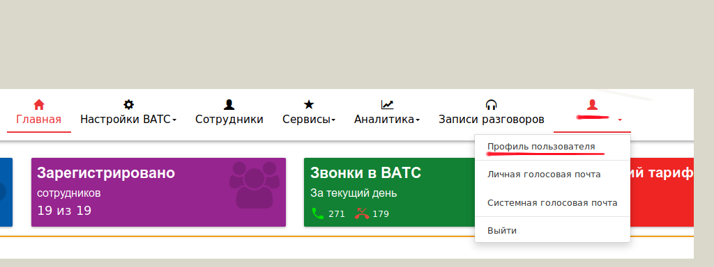
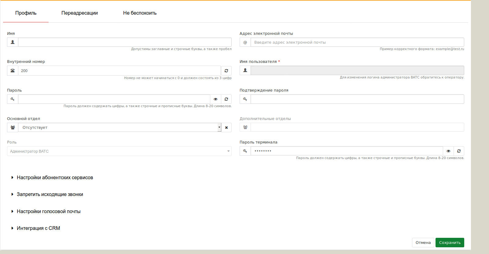
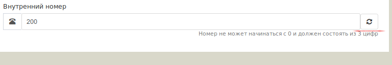
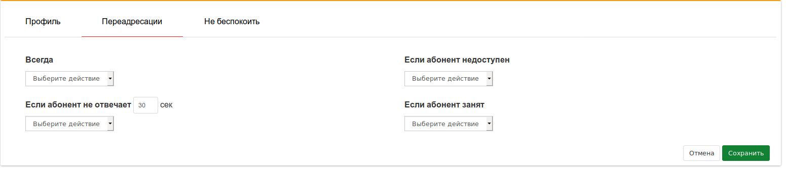

### Профиль пользователя 

Для настройки своей учетной записи следует перейти в меню **Профиль пользователя**, которое находится в разделе **Настройка учетной записи** (см. рисунок ниже).

При переходе в соответствующий пунк меню, откроется окно редактирования свойств **учетной записи пользователя**, которое имеет следующий вид:

Данное окно редактирования настроек, как было указано выше, имеет возможность редактирования системных параметров, которые разделены на следующие разделы:
1. **"Профиль"**
- Основные настройки учетной записи:
    1. **Имя**
    В поле **Имя** - введите имя в необходимом формате. Оно будет отображаться в веб-кабинете ВАТС на странице **Профиль пользователя**. Также, указанное имя будет использовано при отображении имени звонящего на экране телефонного аппарата (_при условии, что сам телефонный аппарат **поддерживает** данную функцию_).
    2. **Адрес электронной почты**
    В поле **Адрес электронной почты** введите адрес электронной почты, который будет использоваться настроенным сервисом **Голосовая почта** для доставки голосовых сообщений.
    3. **Внутренний номер**
    В поле **Внутренний номер** укажите номер телефона в формате, принятом в вашей организации. Это можно сделать вручную или воспользоваться функцией ***Случайное число***, которая создает случайное числовое сочетание, являющееся уникальным (для этого следует нажать нопку находящуюся с правой стороны от поля).

    

    4. **Пароль / Подтверждение пароля**
    В поле **Пароль** введите произвольный набор цифр в диапазоне от 8 до 20 символов. Он будет использоваться для доступа в веб-кабинет ВАТС.
    В поле **Подтверждение пароля** продублируйте информацию, указанную в поле **Пароль**.
    5. **Основной отдел / Дополнительный отдел**
    Указав информацию в полях Основной отдел и Дополнительные отделы, вы можете определить себя в несколько отделов, тем самым контролировать деятельность заведенных в системе сотрудников (в случае если вы имеете права администратора)
    6. **Роль**
    Если вы являетесь **администратором** ВАТС, вы не можете изменить свою функциональную **Роль**
    7. **Пароль терминала**
    В поле Пароль терминала укажите произвольный набор цифр, букв и символов (не менее 8 символов). Он будет использован для регистрации вашего телефонного устройства.
- Абонентские сервисы

> Настройка сервисов осуществляется ***администратором*** ВАТС / отдела при помощи переведения переключателя в позицию ***ON*** –сервис доступен или ***OFF*** – сервис не доступен.

Блоки настройки доступных сервисов:
> ***Настройки абонентских сервисов***
- **АОН** - выбор внешнего номера (номер телефона, который будет отображаться на аппарате вызываемого абонента, при совершении вызова данным пользователем в "город").
- **Перехват вызова** - возможность перехвата вызова внутри отдела при помощи нажатия кнопки или комбинации кнопок на вашем телефонном устройстве (номер для использования сервиса нужно получить у оператора связи).
- **Перевод вызова** - возможность перенаправить вызов на другой номер (сотрудник ВАТС или внешний номер), используя одну кнопку (Transfer, Refer) или комбинацию кнопок (****#***) на вашем телефонном устройстве.
- **Ожидающий вызов** - Возможность приема вызова по второй линии, если вы уже находитесь в разговоре. Так же, доводим до, Вашего, сведения, что данная услуга может не работать при установке некоторых видов "условной" переадресации.

> ***Запретить исходящие звонки*** - блок настроек предоставляет возможность наложить запреты на исходящие звонки данного сотрудника.
- **На городские номера** - при выставлении переключателя в положении ***ON***, вы не сможете совершать звонки на городские номера.
- **На мобильные номера** - при выставлении переключателя в положении ***ON***, вы не сможете совершать звонки на мобильные номера.
- **На междугородние номера** - при выставлении переключателя в положении ***ON***, вы не сможете совершать звонки на междугородние номера.
- **На международные номера** - при выставлении переключателя в положении ***ON***, вы не сможете совершать звонки на международные номера.

> ***Настройки голосовой почты*** - блок настроек пользовательского ящика голосовой почты.
- **Голосовая почта** - включение услуги производится путем выставления переключателя в положение ***ON***.
- **Время перед срабатыванием голосовой почты** - время (***в секундах***) по истечении которого (если пользователь не ответил на вызов) вызов будет перенаправлен для записи голосового сообщения.
- **Дублирование сообщений на электронную почту** - возможность отправить e-mail сотруднику (указывается в поле **Адрес электронной почты** см. раздел **Профиль**) с оставленными голосовым сообщениям. Для включения опции переведите переключатель в положение ***ON***.
> ***Интеграция с CRM*** - блок по использованию услуги **Интеграция с CRM**.

2. **"Переадресации"** - услуга, позволяющая перенаправлять входящий вызов с внутреннего номер сотрудника на другие номера по условию не ответа за заданное время, либо на услугу **"Голосовая почта"**.
 
3. **"Не беспокоить"** - услуга позволяет установить запрет на входящие вызовы для вашего внутреннего номера, задать расписание действия запрета, настроить список номеров-исключений. Для активизации сервиса нажать кнопку Включить сервис. В этом случае все вызовы, поступающие на внутренний номер, будут отбиваться. Если необходимо добавить исключения для конкретных номеров, нажатием кнопку Добавить телефон в исключения после чего сохраняем внесенные данные.