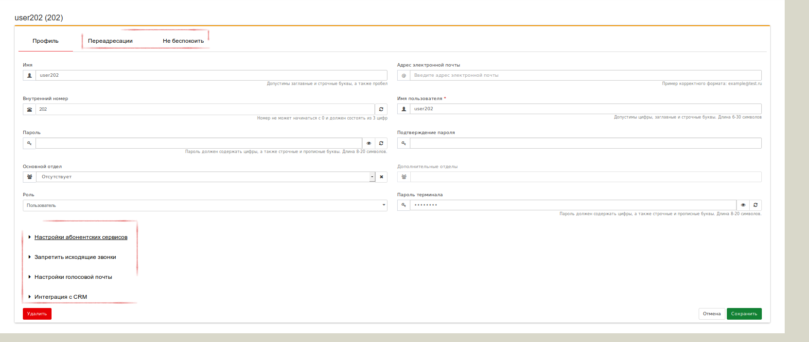

## Раздел "Сотрудники"

Раздел меню, в котором предоставляется возможность:­
  - добавление/редактирование/удаление сотрудников;
  - добавление/редактирование/удаление отделов сотрудников;
  - отображение статуса регистрации терминала сотрудника;
  - получение списка сотрудников в формате CSV.

> Настройка доступна только администраторам ВАТС / отделов.
Перейдя в данный пункт меню, у Вас, появляется возможность настройки внутренней нумерации, Вашей, ВАТС, наряду с возможностью настройки (созданием) логических групп пользователей (отделов).
Ниже представлен типичный вид меню "Сотрудники" у уже функционирующей ВАТС.

Как видно из иллюстрации, логически, данный раздел можно разделить на 2 половины. В левой части настраиваются (создаются) группы пользователей/отделы (в примере уже создан отдел с именем **"группа1"**). А так же, присутствует возможность создания дополнительных отделов (групп пользователей).

> Для создания отдела, необходимо нажать на клавишу **"Добавить"**, расположенную внизу графы **"Отделы"**. После чего, следует заполнить поля, в открывшемся меню создания отдела, а затем, нажать кнопку **"Сохранить"**.

В правой же части страницы распологается панель настроек **"Сотрудники"**.
**Сотрудники** – панель настроек, которая позволяет создать/редактировать/удалять учетные записи сотрудников и настроить доступные сотруднику сервисы и услуги.
Помимо этого, панель содержит дополнительные опции, позволяющие обрабатывать внесенную
информацию: 
 - Сохранить таблицу на CSV – сохранение списка всех созданных сотрудников ВАТС в CSV-файл;
 - Показать всех пользователей – отображение всех созданных сотрудников ВАТС (с и без  отдела);
 - Показать только сотрудников без отделов – отображение всех созданных сотрудников ВАТС без отдела.

Так же, данная панель содержит следующие столбцы:
- **Имя** – имя сотрудника;
- **Внутренний номер** – внутренний номер сотрудника;
- **Роль** – присвоенная сотруднику роль в ВАТС;
- **Отдел** – название отдела, за которым закреплен сотрудник;
- **Статус регистрации терминала** – статус регистрации оборудования, которым пользуется
сотрудник (например, телефонный аппарат).

Для настройки учетной записи сотрудника, необходимо выполнить следующие действия:
1) Нажать кнопку **"Добавить"**, расположенную внизу панели "Сотрудники", после чего, следует заполнить необходимые поля в открывшемся меню создания учетной записи:

 + В поле **Имя** введите имя в необходимом формате, которое будет отображаться в ВАТС, и использован при отображении имени звонящего на экране телефонного аппарата;
 + В поле **Адрес электронной почты** введите адрес электронной почты сотрудника, который будет использоваться настроенными сервисами **Голосовая почта** и **Интеграция с CRM** для доставки голосовых сообщений;
 + В поле **Внутренний номер** укажите номер телефона, согласно формату ВАТС, который будет использован для регистрации телефонного аппарата и совершения вызова сотрудника. (Это можно сделать вручную или воспользоваться функцией *Случайное число*, которая создает случайное числовое сочетание, являющееся уникальным);
 + В поле **Имя пользователя**, следует ввести любое, логически обоснованное значение. Данное значение будет использовано в качестве значения поля **"Имя"** в панели **Сотрудники**, а так же, в качестве **имени пользователя**, для доступа к веб-интерфейсу ВАТС;
 + В поле **Пароль** введите произвольный набор цифр в диапазоне от 8 до 20 символов. Он будет использоваться для доступа в веб-кабинет ВАТС;
 + В поле **Подтверждение пароля** продублируйте информацию, указанную в поле Пароль;
 + Указав информацию в полях **Основной отдел** и **Дополнительные отделы**, вы можете определить сотрудника в несколько отделов, тем самым контролировать деятельность заведенных в системе сотрудников (в случае если ему присвоена Роль администратора отдела).
 + В поле **Роль** задается тип доступа к информации и настройкам ВАТС:
   + *Пользователь* – имеет право управлять только своей учетной записью;
   + *Администратор отдела* – имеет права управления (создание/корректировка/удаление)
учетными записями сотрудников отдела.
 + В поле **Пароль терминала** укажите произвольный набор цифр, букв и символов (не менее 8 символов). Он будет использован для регистрации вашего телефонного устройства.
2) После заполнения всех необходимых полей, следует нажать на кнопку **"Сохранить"**.
3) После создания **"Учетной записи сотрудника"** можно преступать к настройкам абонентских сервисов (если требуется):
    - Выберите созданную ранее **"Учетную запись сотрудника"**;
    - В открывшемся меню, перейдите к настройке абонентских сервисов;

    
> Настройка сервисов осуществляется **администратором** ВАТС / отдела при помощи переведения переключателя в позицию **ВКЛ** –сервис доступен или **ВЫКЛ** – сервис не доступен.

 + **Настройки абонентских сервисов** – блок настроек предоставляет возможность управлять входящими и исходящими вызовами как внутри отделов, так и во всей ВАТС (в зависимости от предоставленной Роли).
   + **АОН** – выбор внешнего номера (номер телефона, который будет отображаться на аппарате вызываемого абонента, при совершении вызова данным пользователем в город).
   + **Перехват вызова** – возможность перехвата вызова внутри отдела при помощи нажатия кнопки или комбинации кнопок на вашем телефонном устройстве (номер для использования сервиса нужно получить у оператора связи).
   + **Перевод вызова** – возможность перенаправить вызов на другого сотрудника, используя одну кнопку (Transfer, Refer) или комбинацию кнопок (*#) на телефонном устройстве сотрудника.
   + **Ожидающий вызов** – возможность приема вызова по второй линии, если сотрудник уже находится в разговоре.
    > Ожидающий вызов не работает с настроенной услугой **Переадресации**.
+ **Запретить исходящие звонки** – блок настроек предоставляет возможность наложить запреты на
    исходящие звонки данного сотрудника:
   + **На городские номера** – при выставлении переключателя в положении **ВКЛ**, сотрудник не
   может совершать звонки на городские номера.
   + **На мобильные номера** - при выставлении переключателя в положении **ВКЛ**, сотрудник не
   может совершать звонки на мобильные номера.
   + **На междугородные номера** - при выставлении переключателя в положении **ВКЛ**, сотрудник не может совершать звонки на междугородние номера.
   + **На международные номера** - при выставлении переключателя в положении **ВКЛ**, сотрудник не может совершать звонки на международные номера.
+ **Настройки голосовой почты** – блок настроек пользовательского ящика голосовой почты.
   + **Голосовая почта** – включение услуги производится путем выставления переключателя в положение **ВКЛ**.
   + **Время перед срабатыванием голосовой почты** – время (в секундах) по истечении которого (если пользователь не ответил на вызов) вызов будет перенаправлен для записи голосового сообщения.
   + **Дублирование сообщений на электронную почту** – возможность отправить e-mail сотрудника (указывается в поле **Адрес электронной почты**) с оставленным на ящике голосовым сообщениям. Для включения опции переведите переключатель в положение **ВКЛ**.
+ **Интеграция с CRM** – блок по использованию услуги Интеграция с CRM. 
   + **Включить** – отправить запрос на синхронизацию данного сотрудника с ВАТС на CRM-систему. Для включения опции переведите переключатель в положение **ВКЛ**.

