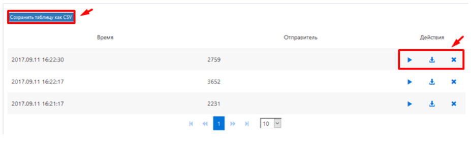

## Голосовая почта

Список файлов с голосовыми сообщениями, оставленными на ваш персональный или системный ящик **Голосовой почты**. На странице можно сохранить список голосовых файлов в виде таблицы CSV-формата, нажав кнопку ***Сохранить таблицу как CSV***. С голосовыми файлами можно выполнить следующие действия: прослушивать, скачивать на персональный компьютер и удалять.

