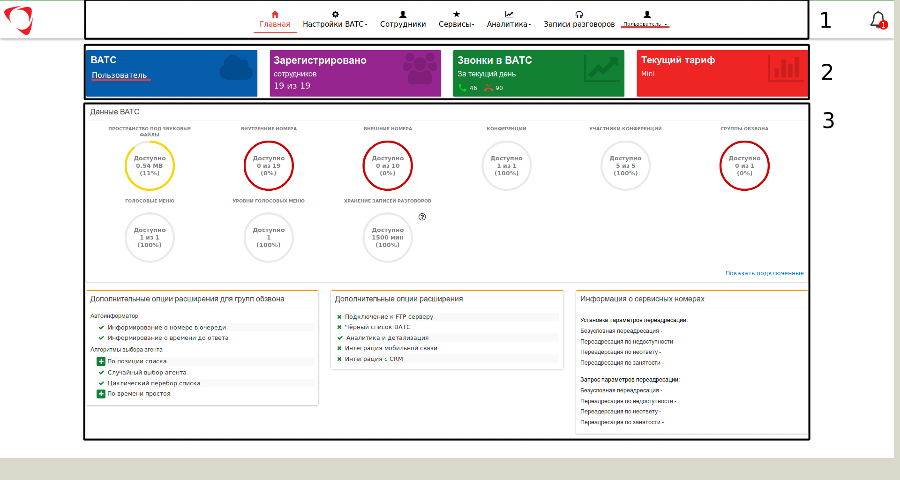

## Начало работы с порталом
* [Веб-кабинет пользователя](pages/work-start/web-cabinet.md)
* [Главная страница веб-кабинета ВАТС](pages/work-start/main-page.md)

###  Главная страница веб-кабинета ВАТС
Главную страницу веб-кабинета пользователя "Виртуальной АТС", логически, можно разделить на 3 базовых блока:

1. **Панель навигации** - представляет собой меню, за каждым элементом которого скрывается страница настроек определенного функционала веб-кабинета.
В большинстве случаев, доступны следующие разделы:
- Настройки ВАТС - пункт меню, который содержит основные настройки для всей ВАТС. Доступные страницы меню:
    - *Настройки* - меню глобальных настроек, влияющих на работу всей АТС (более подробная информация представлена в разделе [Общие настройки](/pages/work-start/common-settings.md)
    - *Тарифы* - список доступных для подключения тарифов
    - *Аудиофайлы* - добавление файлов-мелодий, которые впоследствии можно будет
использовать в некоторых услугах (более подробная информация представлена в разделе **"Аудиофайлы"**).
        - *Внешние номера* - настройка внешних (городских) номеров данной ВАТС, предоставляемых оператором связи (более подробная информация представлена в разделе **"Внешние номера"**).
        - *Маршрутизация* - настройка обработки входящих и исходящих вызовов с использованием доступных опций (более подробная информация представлена в разделе **"Маршрутизация"**).
        - *История операций* - полный список действий, производимых в ВАТС (более подробная информация представлена в разделе **"История операций"**)
- Сотрудники - пункт меню, который включает страницу настроек сотрудников (внутренние номера) и отделов (групп вызова) ВАТС (подробнее см. раздел **"Сотрудники"**).
- Сервисы - пункт меню, который включает страницу со списком доступных для
использования сервисов (подробнее см. раздел **"Сервисы"**).
- Аналитика - пункт меню, который включает различные опции для отображением информации по
вызовам, совершенным в ВАТС (подробнее см. раздел **"Аналитика"**).
- Записи разговоров - пункт меню, содержащий страницу со списками файлов записанных
разговоров с возможностью выполнения действий с ними (прослушивание / удаление). (подробнее см. раздел **"Записи разговоров"**).
- Личный кабинет – пункт меню, содержащий страницу с индивидуальными настройками сотрудника (подробно см. раздел **"Настройка учетной записи"**).
2. **Панель "Виджеты"** - элементы интерфейса в виде отдельных блоков, помогающих получить быстрый доступ к подключенным опциям с возможностью их изменения.
- *ВАТС* - отображает имя текущей "Виртуальной АТС". Нажмите кнопку с изображением облака вверху панели виджета для перехода на страницу настройки ВАТС и абонентов.
- *Зарегистрировано* - отражает количество зарегистрированных в ВАТС сотрудников. Нажмите кнопку с изображением группы людей вверху панели виджета для перехода на страницу **"Сотрудники"**
- *Звонки в ВАТС* - отображает статистику по входящим в ВАТС внешним вызовам (с городских и мобильных номеров). Предоставляется данные по успешным и неуспешным вызовам за текущий день. Нажмите кнопку с изображением графика вверху панели виджета для перехода на страницу **"Аналитика"**.
- *Текущий тариф* - название подключенного тарифа на данной ВАТС. Нажмите кнопку с
изображением вверху панели виджета для перехода в раздел меню Настройки ВАТС > Тарифы.

3. **Дополнительные услуги** - панель, на которой отображаются подключенные в ВАТС
услуги, с возможностью покупки расширений для них. Список доступных услуг:
- Пространство под звуковые файлы – элемент панели, отображающий используемый и доступный объем в Мбайт под файлы мелодий (загружаются в разделе Настройки ВАТС > **"Аудиофайлы"**).
- Внутренние номера – элемент панели, отображающий количество используемых и доступных для добавления внутренних номеров для сотрудников.
- Внешние номера – элемент панели, отображающий количество используемых и доступных внешних (городских) телефонных линий (номеров).
- Конференции – элемент панели, отображающий количество используемых и доступных для добавления сервисов «Конференции» (подробно см. раздел меню Сервисы > **"Конференции"**).
- Участники конференции – элемент панели, отображающий общее количество участников, которые могут участвовать в конференции (подробно см. раздел меню Сервисы > **"Конференции"**).
- Группы обзвона – элемент панели, отображающий количество используемых и доступных для добавления сервисов «Группа обзвона» (подробно см. раздел меню Сервисы > **"Группа обзвона"**).
- Голосовое меню – элемент панели, отображающий количество используемых и доступных
для добавления сервисов «Голосовое меню» (подробно см. раздел меню Сервисы > **"Голосовое меню"**).
- Уровни голосовых меню – элемент панели, отображающий количество используемых и доступных для добавления уровней перехода внутри сервиса «Голосовое меню» (подробно см. раздел меню Сервисы > **"Голосовое меню"**).
- Хранение записей разговоров – элемент панели, отображающий используемый и доступный объем в ***минутах*** под файлы записанных разговоров.