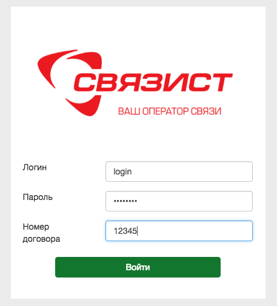

##  Веб-кабинет сотрудника.

По факту заключения договора с оператором связи вам будут предоставлены адрес (например, https://vats.sv-tel.ru) и персональные данные (логин, пароль, номер договора) для доступа в личный кабинет ВАТС.

Для того чтобы зайти в веб-кабинет, выполните следующие действия:

0. Откройте веб-браузер.
0. В адресной строке введите https://vats.sv-tel.ru
0.  В появившемся окне (см. рис. ниже) в поле Логин введите учетное имя сотрудника, предоставленное оператором связи. В поле Пароль укажите пароль от учетной записи сотрудника, представленное оператором связи. В поле Название договора введите индивидуальный номер договора, предоставленный оператором связи.

